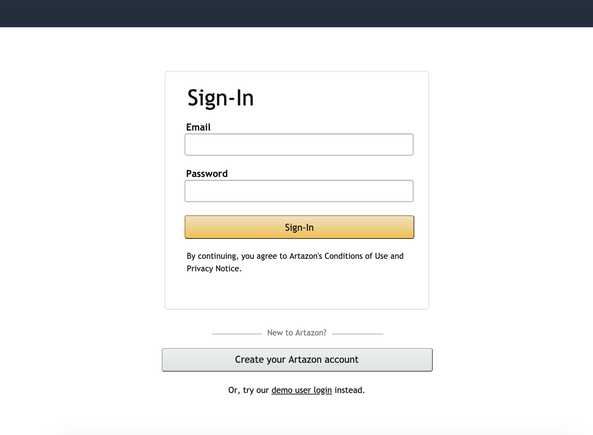
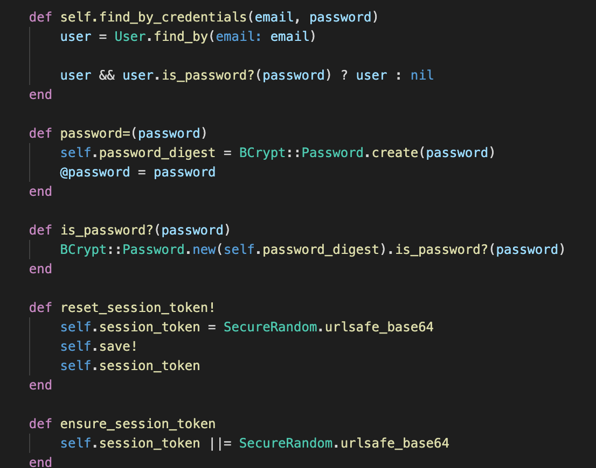
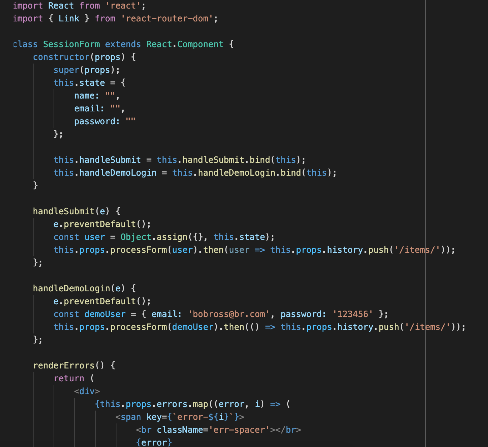
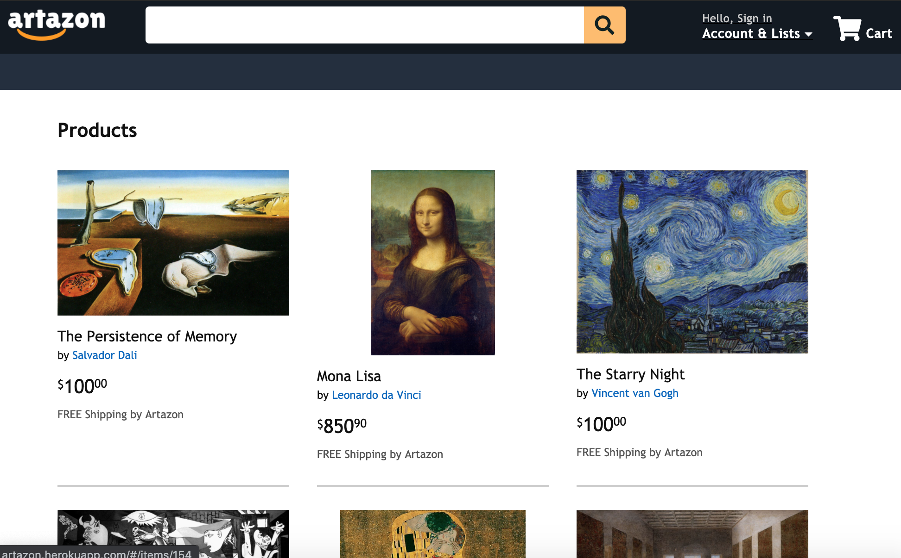
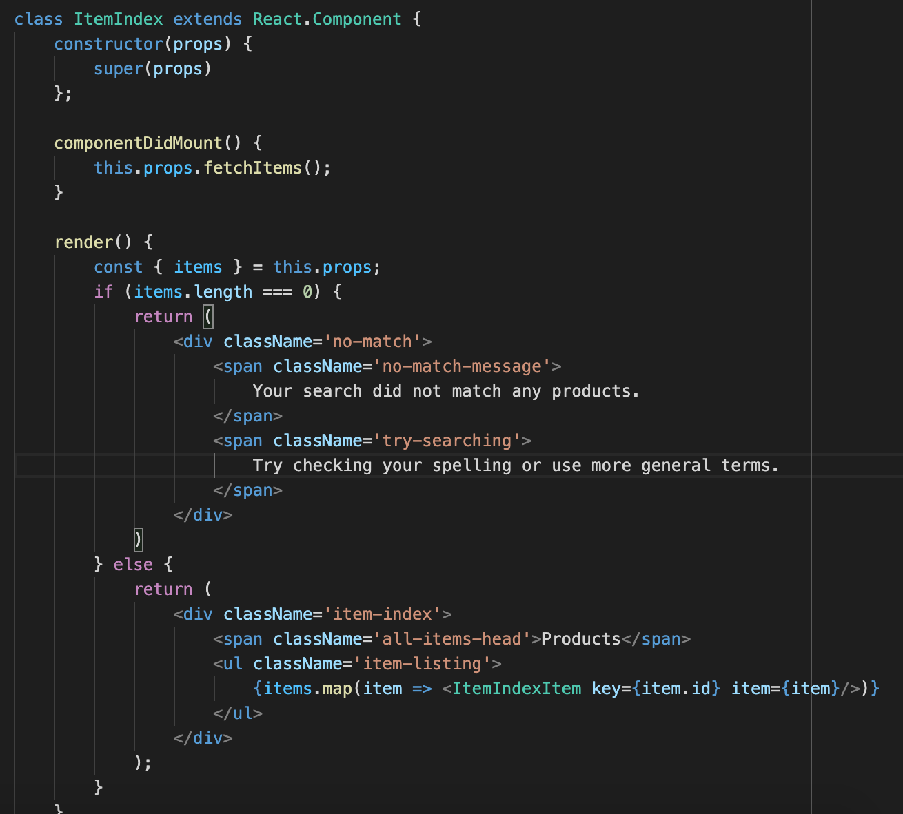
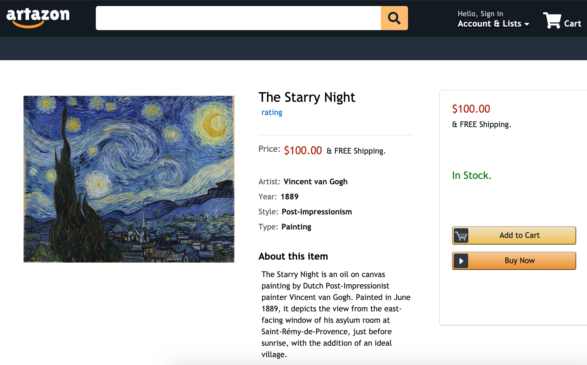
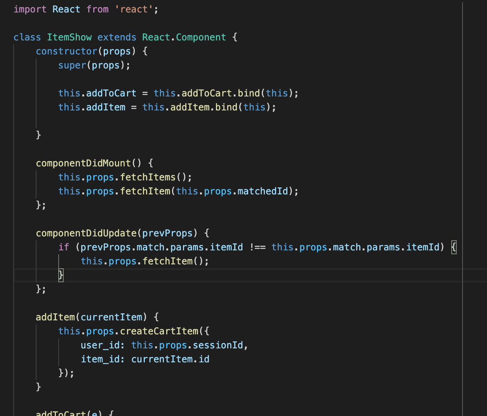
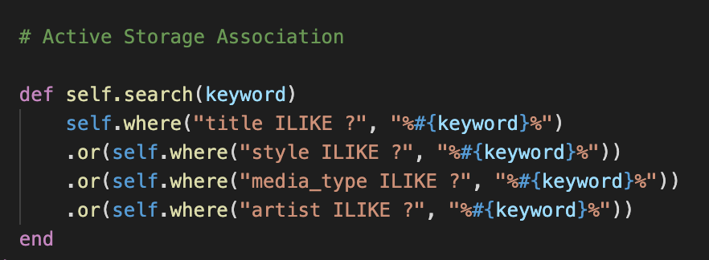
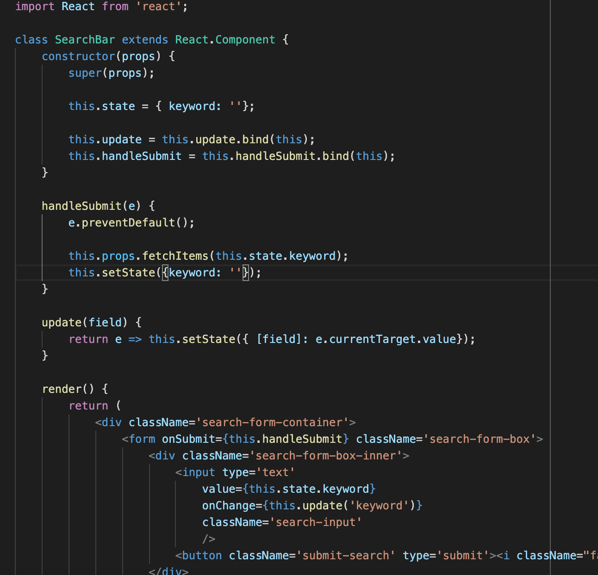
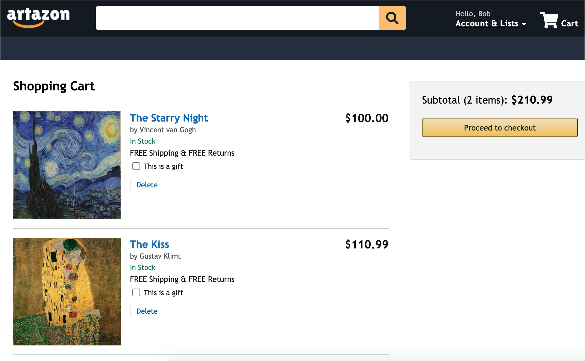

# Artazon

View <a href='http://artazon.herokuapp.com/'>Artazon</a>

<h2>Background</h2>

  Artazon is a full stack web application used to buy/sell famous artworks, inspired by the website Amazon. This application allows users to create an account and sign in, storing their inputted data in the PostgreSQL database. There is also an option for users to continue into the application using a guest login feature. This way the user does not need to create an account to browse through different products and get the full customer experience. On the items index page, users are able to interact with individual items, clicking into the item show page to view details and potentially purchase the item.

  This site was built on a Ruby on Rails framework for the backend with Active Record to avoid N+1 queries. The database utilized to store user/product data was PostgreSQL, along with Amazon AWS S3 which was used to store product images. React and Redux with Node.js were the technologies used for frontend frameworks in order to create a dynamic, single-page web application, allowing for a smooth navigation throughout the website. 

<h2>Technologies</h2>

<ul>
    <li>Ruby (v 2.5.1)</li>
    <li>Rails (v 5.2.4.3)</li>
    <li>React.js</li>
    <li>Redux.js</li>
    <li>Node.js</li>
    <li>SQL/PostgreSQL</li>
    <li>Webpack</li>
    <li>Amazon AWS S3</li>
</ul>

<h2>Features</h2>

<h3>User Authentication</h3>

</img>

<ul>
    <li>Users can sign up and create an account on Artazon, storing their information to be able to logout and log back in to view their personal account.</li>
    <li>The sign-in and signup forms are separate components which were made using React/Redux and CSS for styling purposes. These forms can be accessed through a dropdown menu from the navigation bar or by clicking on explicit links on the home page. </li>
    <li>For users who do not want to create their own account but still want to explore the full features of the website, a demo login feature is available that serves as a guest login.</li>
</ul>

<h4>Code Snippets</h4>

Backend Ruby model snippet for user authentication:

</img>

Frontend React component snippet for user authentication:

</img>

<h3>Items Index</h3>

</img>

<ul>
    <li>All items are rendered when accessing the home page (which can be accessed by entering the website's URL or clicking on any Artazon logo) or first logging into a user's account.</li>
    <li>Users can go directly to an item's show page by clicking on either the item's title or image on the list. </li>
</ul>

<h4>Code Snippets</h4>

Frontend React component snippet for product index:

</img>

<h3>Item Show Page</h3>

</img>

<ul>
    <li>Users can view each item's information page, which includes a high-res image of the art piece, the artist and year created, style and media type, a short description, and the price to purchase the item. </li>
    <li>On the right-most side of the show page is a component that users will be able to use in order to either add an item to their shopping cart or purchase the item without a cart using the "Buy Now" button.</li>
    <li>Below the item description and image, there is a section where users can rate and review the item if they are signed in with their account.</li>
    <li>Right below the item's title will be an average rating that the item has received so far.</li>
    <li>Each item's image is linked from a bucket created in Amazon AWS S3.</li>
</ul>

<h4>Code Snippets</h4>

Frontend React component snippet for item show page:

</img>

<h3>Search Bar</h3>

</img>

<ul>
    <li>Users can type in any phrase in the search bar located in the navbar at the top of the page.</li>
    <li>Upon hitting enter, any products related to the search term (whether it is part of the title, the artist, style, etc) will render on the page for the user to browse.</li>
    <li>Products are searched for and displayed through an Ajax request, using JSON/jBuilder views as well as ActiveRecord to match the inputted term with any related products.</li>
</ul>

<h4>Code Snippets</h4>

Backend SQL ActiveRecord snippet for search feature:

</img>

Frontend React component snippet for searchbar:

</img>

<h3>Shopping Cart</h3>

</img>

<ul>
    <li>Once users click on a product from any item index (whether it is all items or from a specific search), they have the option to add the item to their cart.</li>
    <li>Each user has exactly one cart, and each cart can only be accessed if the user is logged in.</li>
    <li>If the user is not logged in and attempts to add an item to his/her cart, the app renders a login form so that the user can either log in with his/her account information or continue with the guest login option.</li>
    <li>After the user is satisfied with the items in the cart, he/she can "checkout" by clicking the "Proceed to checkout" button. </li>
</ul>

<h4>Code Snippets</h4>

Frontend React component snippet for shopping cart:

</img>